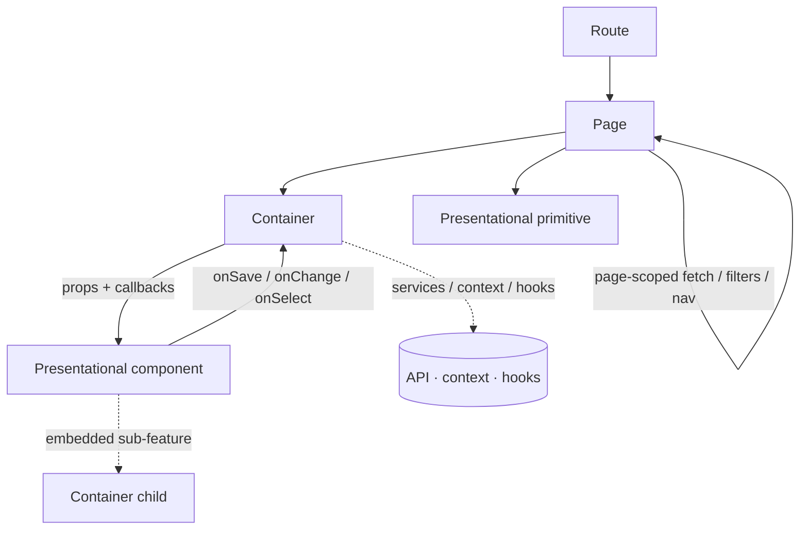

# BinaryHeart Inventory System — Frontend

The web client for the BinaryHeart Inventory System: a single-page application for tracking
devices, parts, tools, donations, parties (donors/recipients) and chapter inventory. It is an
installable PWA with camera-based barcode/QR scanning and Niimbot label printing.

## Tech stack

- **React 19** + **TypeScript** (strict)
- **Vite** for dev server and production build
- **React Router v7** (data router — `createBrowserRouter` + `RouterProvider`)
- **Tailwind CSS v4** (via `@tailwindcss/vite`)
- **Recharts** for dashboard charts
- **@zxing/browser** for the camera scanner
- **jsPDF / JsBarcode / @mmote/niimbluelib** for labels and receipts
- **ESLint** (with `eslint-plugin-react-hooks`) + **Prettier 3.6.2**

## Getting started

Prerequisites: Node 24 (see the Dockerfiles) and npm.

```bash
npm ci            # install exact locked dependencies
npm run dev       # start the Vite dev server (HMR)
```

The dev server proxies `/api` and `/tables` to the backend. By default it targets
`http://localhost:8080`; override with the `VITE_API_TARGET` env var:

```bash
VITE_API_TARGET=http://localhost:9090 npm run dev
```

For local full-stack development, use the repository root `docker-compose.yml` /
`scripts/run.sh`, which brings up the backend, database and this frontend together.

## Scripts

| Script                 | Description                                                       |
| ---------------------- | ----------------------------------------------------------------- |
| `npm run dev`          | Start the Vite dev server with HMR.                               |
| `npm run build`        | Type-check (`tsc -b`) then produce a production build in `dist/`. |
| `npm run preview`      | Serve the production build locally.                               |
| `npm run lint`         | Run ESLint over the project.                                      |
| `npm run format`       | Format all files with Prettier.                                   |
| `npm run format:check` | Verify formatting without writing (used in CI).                   |
| `npm run gen-types`    | Regenerate `src/types/api.d.ts` from the backend OpenAPI schema.  |

Before pushing, make sure the CI gate passes:

```bash
npm run lint && npm run build && npm run format:check
```

## Architecture: Container / Presentational / Page

This codebase follows a strict three-layer separation. Every piece of UI belongs to exactly one
layer, and the layers may only depend "downward".

### 1. Components (`src/components/`) — presentational

UI only: **props in, JSX out.**

- **May**: hold local _view_ state (`useState`/`useMemo` for controlled inputs, hover,
  expand/collapse, form drafts, local sorting), import pure utilities, and import types
  (`import type`).
- **May not**: call services or the API, read context, use data hooks
  (`useLookups`, `useChapters`, `useAddAsset`, …), or navigate (`useNavigate`/`useLocation`).
- Behaviour reaches a component only through callback props (`onSave`, `onChange`, `onSelect`, …).

Components are flat inside `components/`. A multi-file sub-feature gets its own folder — currently
`components/add-asset/`.

> A presentational component **may** render a _container_ child when it embeds a self-contained
> sub-feature (for example `AddAssetModal` renders `DevicePickerModalContainer` and
> `PartyPickerModalContainer`). This keeps nested logic out of the parent without leaking it into
> the page.

### 2. Containers (`src/containers/`) — logic

A container feeds data and behaviour to **one** presentational component. It owns everything a
component is not allowed to touch: fetching, persistence, optimistic updates, context, and
navigation.

- Naming: a container is suffixed `Container` and lives in `containers/`
  (e.g. `NotesPane` → `NotesPaneContainer`).
- **Exception**: `ProtectedRoute` is a route guard, not a wrapper around a single presentational
  component, so it keeps its plain name.
- A container renders its presentational component and passes props/handlers; it contains no
  significant markup of its own.

### 3. Pages (`src/pages/`) — route targets

Pages are what routes render. A page composes containers and presentational primitives into a
screen and owns **page-scoped** concerns:

- mount-time fetches, URL/param parsing, filter state, and page-scoped navigation.
- Pages render **containers** for any logic-bearing feature. Pages may render presentational
  primitives (`PageHeading`, `Breadcrumb`, `Section`, `LoadingSpinner`, charts, tables, …)
  directly, because those are fed entirely by page-owned props — wrapping them in a pass-through
  container would add no value.

### Data flow



### Deciding where code goes

- Does it fetch, persist, read context, or navigate? → **container** (or page-scoped logic on a
  page).
- Is it pure UI driven only by props (plus local view state)? → **component**.
- Is it a whole screen wired to a route? → **page**.

If a component starts needing a service, context, or a data hook, extract that logic into a
`…Container` and keep the component presentational.

## Project structure

```
src/
  main.tsx            App entry; mounts <App/> and registers the service worker.
  App.tsx             Data router (createBrowserRouter), providers, app shell, route table.
  index.css           Tailwind entry + global/mobile (responsive-cards) styles.

  pages/              Route targets (Dashboard, Devices, DeviceDetail, Parts, Tools,
                      Donations, PartyDetail, Reports, Chapters, Search, Scanner,
                      Settings, Account, AdminAccounts, ManageParties, Login, …).
  containers/         Logic wrappers (…Container) + ProtectedRoute + UnsavedChangesGuard.
  components/         Presentational UI (flat) + add-asset/ sub-feature folder.

  context/            React context providers: Auth, Chapter, Toast, AddAsset.
  hooks/              Reusable hooks: useLookups, useInfiniteScroll, useLinkedParty,
                      useDashboardData, useBarcodeScanner, useCameraScanner, useAssetScan,
                      useMediaQuery, usePWA.
  services/           API access layer (api.ts + per-domain services) and export helpers.
  types/              Domain types (inventory.ts, changelog.ts) and generated api.d.ts.
  utils/              Pure helpers: formatting, CSV, roles, brand colours, form styles,
                      canPrintLabels, service-worker registration, receipt generation.
  assets/             Static assets imported by code.

public/               Static files served as-is: manifest.webmanifest, sw.js, icons, fonts.
```

## Routing

Routing uses the React Router **data router** (`createBrowserRouter` + `RouterProvider`) so that
`useBlocker` (unsaved-changes guarding) works. `RootLayout` mounts the context providers inside
the router, and `AppShell` renders the sidebar/mobile chrome plus an `<Outlet/>`. Every route
except `login` is wrapped in `ProtectedRoute`.

## State & data

- **Context** (`src/context/`): `AuthContext` (session), `ChapterContext` (chapter lists +
  visibility/writability), `ToastContext` (notifications), `AddAssetContext` (global add-asset
  modal).
- **Services** (`src/services/`): all HTTP goes through `api.ts` (which owns `buildQuery`,
  `fetchAllPages`, pagination helpers); per-domain services (`deviceService`, `partService`,
  `toolService`, `partyService`, `noteService`, `lookupService`, `accountService`,
  `chapterService`, …) wrap it. Only containers, hooks, and page-scoped logic call services.
- **Hooks** (`src/hooks/`): shared behaviour such as `useInfiniteScroll` (paginated lists) and
  `useLookups` (lazily fetched dropdown options).

## Styling

Tailwind CSS v4 is configured through the Vite plugin; `src/index.css` is the Tailwind entry and
also holds the `responsive-cards` rules that collapse tables into stacked cards on small screens.

## PWA

The app is installable. `public/manifest.webmanifest` and a hand-written `public/sw.js`
(app-shell caching only — API/table responses are never cached) are registered via
`src/utils/registerServiceWorker.ts` (skipped in dev). Mobile builds expose a bottom tab bar and a
camera Scanner page on touch devices.

## Type generation

`src/types/api.d.ts` is generated from the backend's OpenAPI document. After the backend schema
changes and has been built, regenerate it:

```bash
npm run gen-types
```

## Conventions

- ESLint runs with `eslint-plugin-react-hooks`. In this project
  `react-hooks/set-state-in-effect` and `react-hooks/refs` are **errors** — do not `setState`
  synchronously in an effect body (seed via a `useState` initializer, remount with a `key`, or
  defer) and do not assign `ref.current` during render.
- Formatting is enforced with Prettier 3.6.2 (`npm run format:check`).
- Keep the layer rules above: components stay presentational; logic lives in containers or
  page-scoped code.
